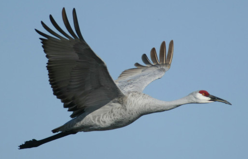
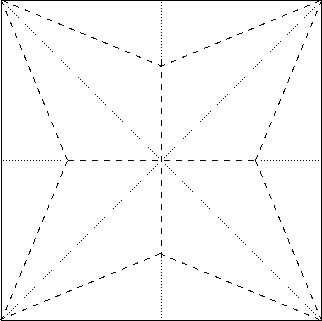
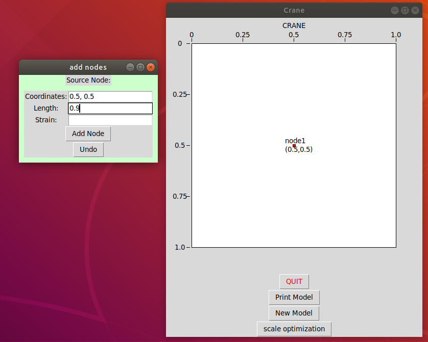

# Origami

The contents of this readme are:
1. Introduction
2. Program Walkthrough
3. Circle Packing and Origami Mathematics

### Introduction

The art of origami paperfolding has gone through enormous innovation in the past twenty years through an unlikely source – circle packing mathematics. Now it is possible not just to fold simple cranes and boxes, but complex, anatomically correct sculptures of arthropods, deer, and other forms with many branches, long limbs, and unusual body geometry. The process of designing these models is both art and engineering, and the design can done computationally.

It works like this – take a subject that you want to want to fold into an origami model:

Draw a stick figure representation of the subject.

Then do a bunch of complicated math...

(packing circles with edge connections related to the topology of the original tree diagram! nonlinear optimization! Scale optimization! Edge optimization! Strain optimization! Univeral polgyon molecules!)

...to get a crease pattern. These are all of the folds that make up the structure of an origami model.

Fold on the creases to get an origami model with a basic structure just like the stick figure diagram. For the origami crane, this structure is a traditional fold called the "bird base" which can be seen on the right. On the left is the same structure from a different view. Notice the similarity to the stick figure diagram.

Unfortunately, math cannot do the rest. It's art!

### What about this program?

The Origami Design Tool does one piece of this process. In the program you can build two important components, the representation of the paper, and the representation of the model, and the relationship between the two. The paper is represented as a coordinate system, with a max width and height of 1.0 for squares, though rectangles are possible. 

To build the model representation, this is done by building a tree graph, where each edge has length and strain attribute. The mapping from the model to the paper is given by initial coordinates for each node on the graph. The purpose of the optimization is to find the coordinates for each node such that the distances between the nodes holds in a certain way (circle packing...) and so that the paper is used (covered by circles) in the most paper efficient manner. This is called a scale optimization, which is only one piece of the full number of mathematical tools involved for a complete crease pattern. What it does do is place the leaf nodes of the graph in the same locations as the tips of the limbs for an origami model. This is a significant insight into the structure of a model.

### Walkthrough

To install, create a virtual environment with a python2 interpreter and run `pip install -r requirements.txt`.
Make sure that the variables run_simple_examples and run_complex_examples are set to False and run_gui is set to True in the main.py file.
Run the program with `python main.py`

In the gui click "New Model" and put in a name and the height/width of your paper.

Submit this to see a picture of the coordinate system representing the paper. Input the first node, which will be the source node, or one of multiple source nodes. It represents the vertex that leaf nodes are attached to and it's length / strain does not matter. After submission the node should appear on the coordinate system.

When submitting additional nodes, use the radio box to select their 'source node'. An edge will be created between the new node and the source node. The length is the length of this edge. Strain is a number representing how distorted the edge length is allowed to be for a crease pattern to be found. Fixed edge lengths must have a strain of 0. Circles of size relative to the length are drawn on the paper frame. It's also important to note that the apparent length of the edge as drawn is not the same as the actual length.

When the full tree diagram is drawn then you can click scale optimization. A successful optimization will find new locations for the vertices so that the size of the paper is minimized while the all constraints are held. This is equivalent to finding the vertex locations such that the largest origami model having the topology of the original tree can be folded from the paper. (The picture is for a tree where all edges are length 1.0 and strain 0.0)

Note the similarity to the crane crease diagram in the introduction!

### Circle Packing and Origami Mathematics

coming soon...
